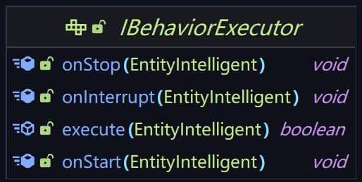

# 第一章 行为 - 描述实体逻辑的最小单元

_**author: daoge_cmd**_

## 1.0 导言

生物是MC的重要组成部分。然而，从古至今，生物特性缺失问题一直是NK系（乃至第三方）服务端的硬伤。

我们很高兴在社区中看到了一些成功的解决方案，例如第三方插件[MobPlugin](https://github.com/Nukkit-coders/MobPlugin)。 然而很遗憾，类似的插件尽管能弥补NK系服务端没有生物的遗憾，其运行效果却令人一言难尽。拿MobPlugin来说，其混乱的架构设计+特性的大量缺失+差强人意的刷怪逻辑使我们不得不抛弃 [NukkitPetteriM1Edition](https://github.com/PetteriM1/NukkitPetteriM1Edition) 的做法（内置MobPlugin）

我们选择自行设计架构。尽管[过程很艰难](https://www.minebbs.com/threads/powernukkitx-ai-2022-7-29.13358/)（3次推翻重写+无数次测试和优化），但是我们最终做到了。 PNX的生物AI框架无论在性能，效果，易用性上都完全超过了社区其他实现。我们相信，PNX的实体AI框架结合稍早前推出的自定义实体/物品/方块API，Terra生成器等将会助力各位插件开发者更好地实现自己的创想，让RPG、探索类等服务器类型达到新的高度

对于性能，我们实现了完全的异步+并行，这使得其能完美利用多核机器。在我们的开发测试中（测试机为笔者电脑），PNX成功实现了2600个实体（羊）同屏、在完全还原原版特性的情况下，以稳定的20tps流畅运行。

设计过程中，我们借鉴了JE原版的Memory，Activity，Behavior，同时融合了BE原版的模块化（组件化）等思路，这使得框架本身具有极高的易用性。为了体现易用性，核心完全实现了监守者(Warden)，狗，僵尸，苦力怕等生物。其中监守者作为原版行为最复杂的生物之一，笔者基于PNX生物AI框架非常轻松地就实现了其包括但不限于```近战/远程攻击切换```，```愤怒值系统```等逻辑。您现在就可以开启一个PNX服务器并生成监守者，或[查看源码](https://github.com/PowerNukkitX/PowerNukkitX/blob/master/src/main/java/cn/nukkit/entity/mob/EntityWarden.java)以了解其实现，我们相信这是框架易用性的最好证明

我们将以“羊”这个生物作为例子，介绍框架的每个部分

## 1.1.0 行为 - 描述实体逻辑的最小单元

不难想到，一只完整的羊拥有以下行为：

- 看向最近玩家
- 随机漫游
- 受到伤害时逃跑
- 跑向手里拿着小麦的玩家
- 吃草
- 交配

这些行为相互独立，我们称每个独立的行为为一个```Behavior```。这样，羊的复杂逻辑就这样被我们抽象成一个一个```Behavior```了

### 1.1.1 行为评估器与执行器

当然，只有```Behavior```显然不够。我们注意到，在羊的整个生命周期中，并不是所有行为都在运行。意识到这一点后，我们将```Behavior```继续细分成```BehaviorExecutor```（行为执行器）和```BehaviorEvaluator```（行为评估器），其中```BehaviorExecutor```包含了此行为被激活时具体要做的事情，```BehaviorEvaluator```则包含了决定此行为是否应该被激活的逻辑。

我们需要特别注意的是评估器与执行器的关系。来到源码，两者的接口描述如下：




若行为处于非激活状态，评估器的```evaluate```方法将每gt(可调)被调用一次。

当```evaluate```方法返回```true```时，代表此次评估成功，执行器的```execute```方法将会被每gt(可调)调用一次，直到```execute```方法返回```false```

注意，当行为处于激活状态时，其评估器将不会再被调用。换言之，处于激活状态的行为何时停止由执行器决定或被更高优先级行为覆盖（详见下段）。

当行为执行器由于返回```false```而主动停止激活，其```onStop```方法将会被调用，然而如果是被更高优先级行为覆盖导致的中断，则会调用其```onInterrupt```方法而不是```onStop```。

### 1.1.2 行为优先级

行为自身不仅存在执行条件，事实上行为之间也存在相互制约的关系。例如当羊发现范围内存在手里拿着小麦的玩家，其处于激活状态的```随机漫游```行为就应该停止运行。我们将行为之间的这种关系称之为优先级覆盖原则，即每个行为都具有一个特定的优先级。当有高优先级的行为被激活时，正在运行的低优先级的行为就应该被中断；对于优先级相同的两个行为，他们可以同时处在激活状态

我们将羊的行为按照优先级顺序由高到低重新排列：

- 4 受到伤害时逃跑 
- 3 交配 
- 2 跑向手里拿着小麦的玩家 
- 1 吃草 
- 0 看向最近玩家 & 随机漫游 

### 1.1.3 通过组合评估器与执行器来创建行为

为了编写一个新的行为，你也许会选择创建一个叫做```MyBehavior```的类并同时实现接口```IBehaviorExecutor```以及```IBehaviorEvaluator```。

事实上我们不这么做，我们采用“委托”的做法来创建行为。目光聚焦到类```Behavior```以及其继承关系上:


类```Behavior```同时实现了接口```IBehaviorExecutor```以及```IBehaviorEvaluator```，其构造函数要求提供评估器与执行器实现并在内部委托其方法。这样子做的最大好处是可以复用已有的评估器与执行器快速地创建全新的行为而不用重复编写逻辑。

类```Behavior```同时还包含行为的优先级，评估周期等属性。你可以[查看源码](https://github.com/PowerNukkitX/PowerNukkitX/blob/master/src/main/java/cn/nukkit/entity/ai/behavior/Behavior.java)以了解详细

### 1.1.4 核心行为

若我们不想某行为参与到行为之间的优先级”竞争“中，我们也可以选择将行为注册为```CoreBehavior```(核心行为)。核心行为之间不存在优先级覆盖原则，其激活与否只取决于自身评估器

## 1.2.0 行为组 - 行为的容器，但不仅仅是

行为组```BehaviorGroup```存放一系列行为。例如上面羊的所有行为就是一个行为组。

事实上，行为组并不只是行为的容器，其实际上包含了一类生物的全部逻辑组件，本章介绍的行为只是其组件的一部分。一个完整的行为组包含：

- 行为，核心行为
- 记忆存储（连接所有组件的桥梁）
- 传感器（用于从环境中收集数据并写入到实体的记忆）
- 寻路器（提供寻路实现）
- 控制器（提供生物运动实现）

详细请见第六章